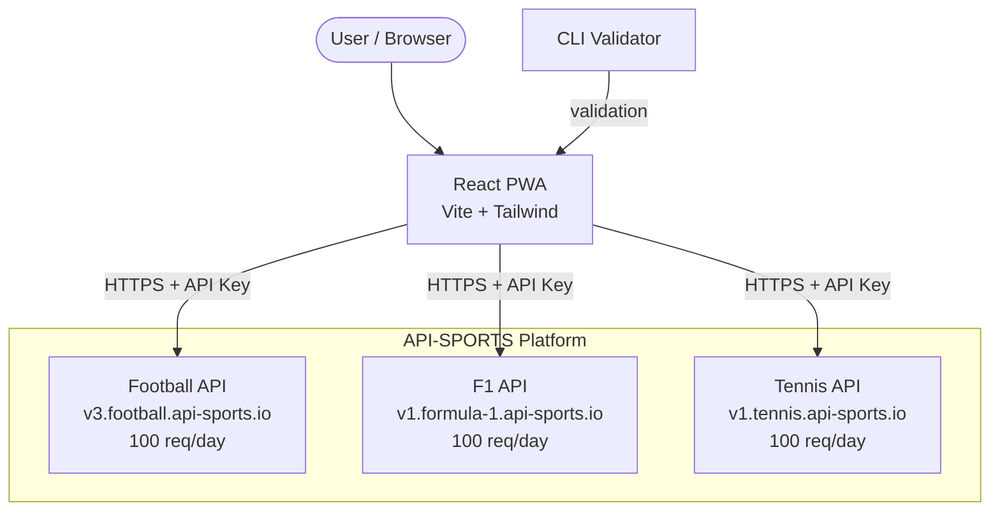
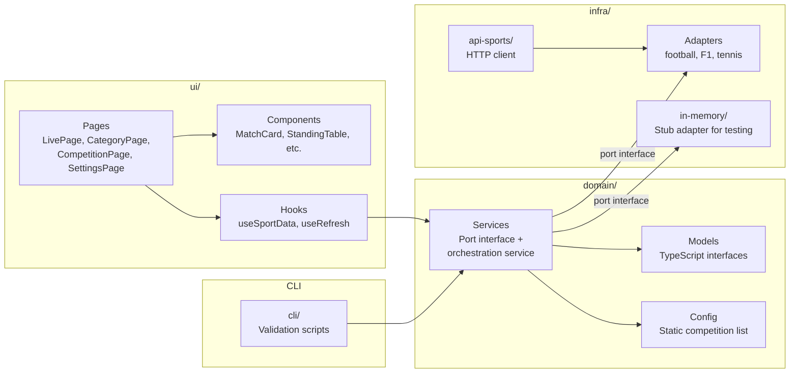
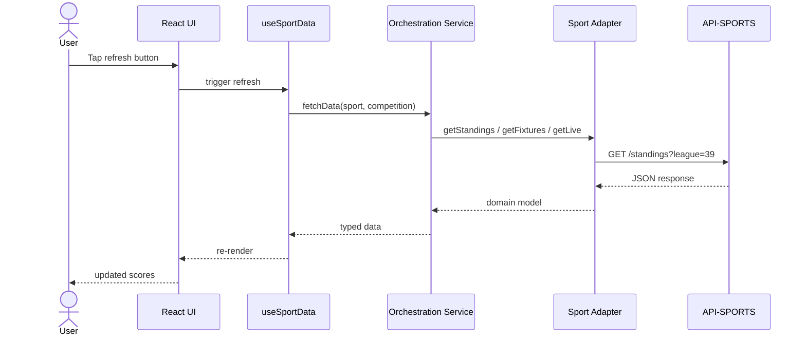

# System Architecture

## High-Level Overview



## Internal Architecture



## Data Flow



## Directory Structure

```
src/
├── domain/          # Business logic (no framework dependencies)
│   ├── models/      # TypeScript interfaces for all sports
│   ├── config/      # Static competition list (hardcoded)
│   └── services/    # Port interface + orchestration service
├── infra/           # External integrations
│   ├── api-sports/  # HTTP client + adapters (football, F1, tennis)
│   └── in-memory/   # Stub adapter for testing
├── ui/              # React components
│   ├── components/  # Reusable (MatchCard, StandingTable, etc.)
│   ├── pages/       # LivePage, CategoryPage, CompetitionPage, SettingsPage
│   └── hooks/       # useSportData, useRefresh
└── cli/             # CLI for validation
```
